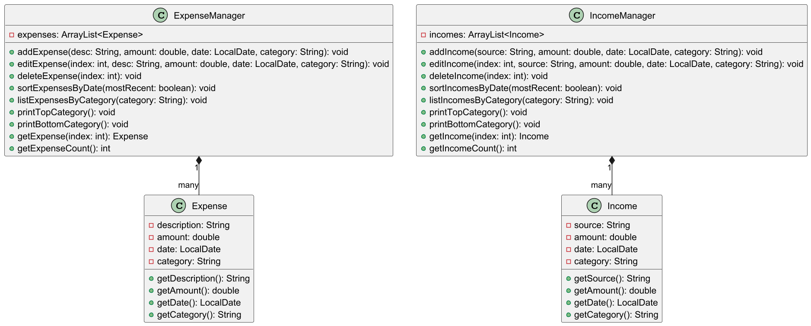

# Developer Guide

## Acknowledgements

- The command parsing design is inspired by the Command Pattern described in the SE-EDU AddressBook-Level3.
- Parts of the error-handling and assertion patterns were referenced from Oracle’s Java tutorials.
- Logger setup referenced from standard Java logging documentation.

## Design & implementation

### 1. Nicholas

Responsible for implementing the **Expense** and **Income** management modules. This includes the `Expense`, `Income`, `ExpenseManager`, `IncomeManager`, as well as all associated commands and parsers.

The goal of these modules is to allow users to accurately and efficiently manage their expenses and income with support for adding, editing, deleting, listing, categorizing, and sorting entries.

#### Expense and Income Structure

Each of the two core entities — Expense and Income — is represented by its own class (`Expense`, `Income`) and managed through its own manager class (`ExpenseManager`, `IncomeManager`).
The below shows the high-level class diagram:



#### Command Parsing and Execution

Each command extends from an abstract `ExpenseCommand` or `IncomeCommand` base class and overrides the `execute(...)` method.

Example sequence diagram for the command `add Lunch 12.5 Food 2025-03-25`:


This design simplifies testing, separates concerns clearly, and is extensible to other commands (e.g., filtering by date range in the future).

#### Key Implementation Choices

- **Command Pattern:** Each command is encapsulated in its own class with a single `execute(...)` method. This makes it easier to test and extend in the future.
- **Category Normalization:** Category strings are capitalized by the parser to ensure consistent matching.
- **Robust Input Parsing:** The parser uses defensive programming to avoid crashing on invalid user input, providing feedback when inputs are incomplete or incorrect.

#### Alternatives Considered

- Instead of a separate command class for each operation, we considered a generic `Command` with a type string and arguments. However, this would reduce readability and make each command's logic more error-prone.
- We considered storing all entries in a shared superclass like `FinancialEntry`, but this was not implemented as Expenses and Incomes may diverge in fields and behavior later.

#### Future Enhancements

- Support for recurring entries.
- Advanced search and filtering (e.g., date ranges).
- UI display of graphs or trends.

## Product scope
### Target user profile

- CLI users who prefer keyboard-based interactions.
- Budget-conscious individuals tracking daily spending.
- Students or working professionals managing personal finances.

### Value proposition

- Easy and fast recording of transactions.
- No setup or signup — works locally and offline.
- Lightweight and highly customizable.

## User Stories

|Version| As a ... | I want to ... | So that I can ...|
|--------|----------|---------------|------------------|
|v1.0|new user|see usage instructions|refer to them when I forget how to use the application|
|v2.0|user|find a to-do item by name|locate a to-do without having to go through the entire list|

## Non-Functional Requirements

- Runs on any OS with Java 17+.
- Handles up to 1000 entries without noticeable lag.
- Should respond to commands within 1 second.
- CLI-based, with no need for internet connection.

## Glossary

| Term | Definition |
|------|------------|
| CLI | Command-Line Interface |
| Command Pattern | A design pattern in which each action is encapsulated in its own class |
| Category | A label like Food, Transport, Job, etc., used to group entries |


## Instructions for manual testing

The following steps help a tester verify the correctness of features:

1. **Add an expense:**
   ```
   add Coffee 4.5 Drink 2025-04-01
   ```
    - Expected: "Added: Coffee - $4.5 on 2025-04-01 [Category: Drink]"
   

2. **List expenses:**
   ```
   list
   ```
    - Expected: Display list with the added expense.
   

3. **Edit an expense:**
   ```
   edit 1 Tea 3.0 Drink 2025-04-02
   ```
    - Expected: Entry should be updated to "Tea - $3.0 ..."
   

4. **Delete an expense:**
   ```
   delete 1
   ```
    - Expected: Entry is removed.
   

5. **Add income:**
   ```
   add Salary 2000 Job
   ```

6. **List incomes:**
   ```
   list
   ```

7. **Sort income by date:**
   ```
   sort recent
   ```

8. **Test top/bottom category analysis:**
   ```
   top
   bottom
   ```

Note: Manual testing does not persist data unless storage is implemented. Re-adding entries is required after restarting the app.