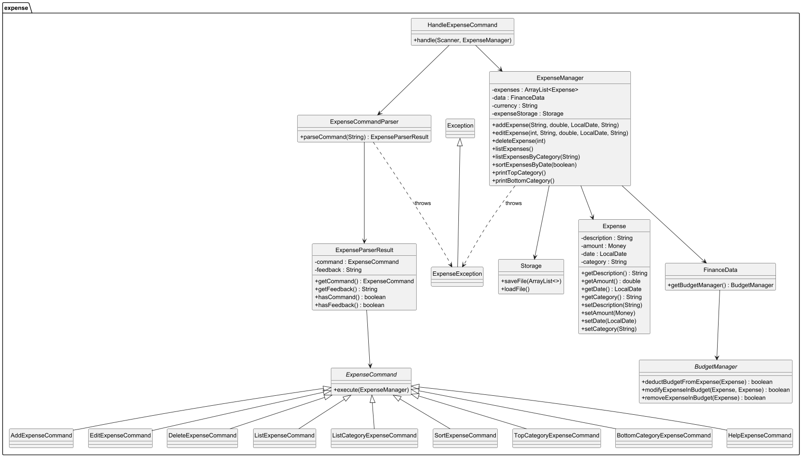
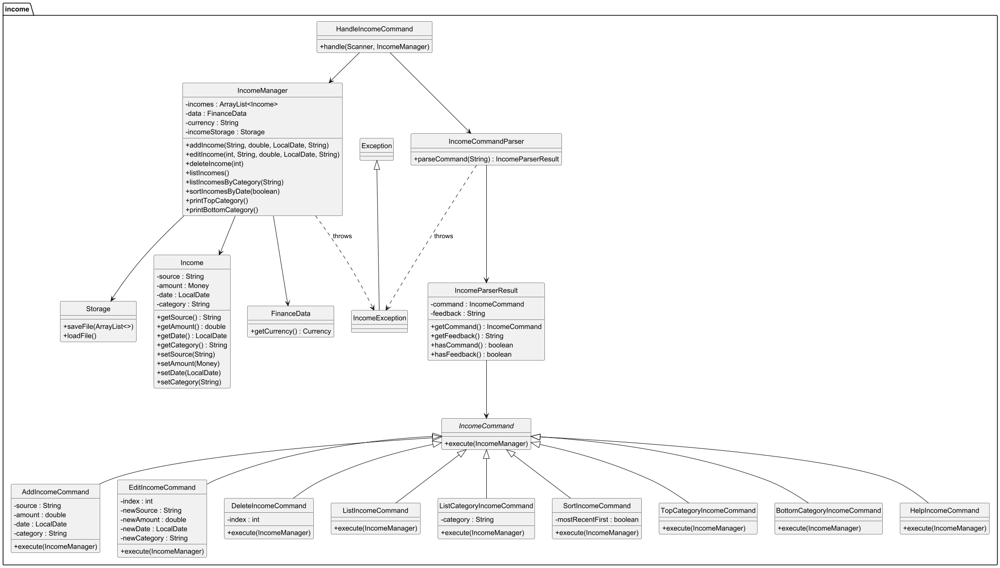
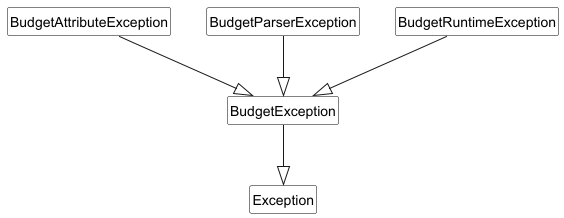
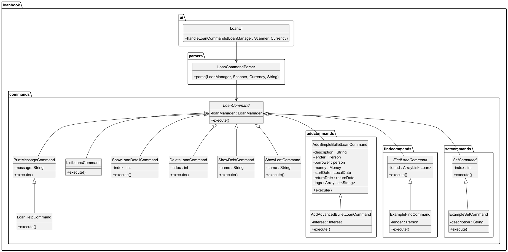
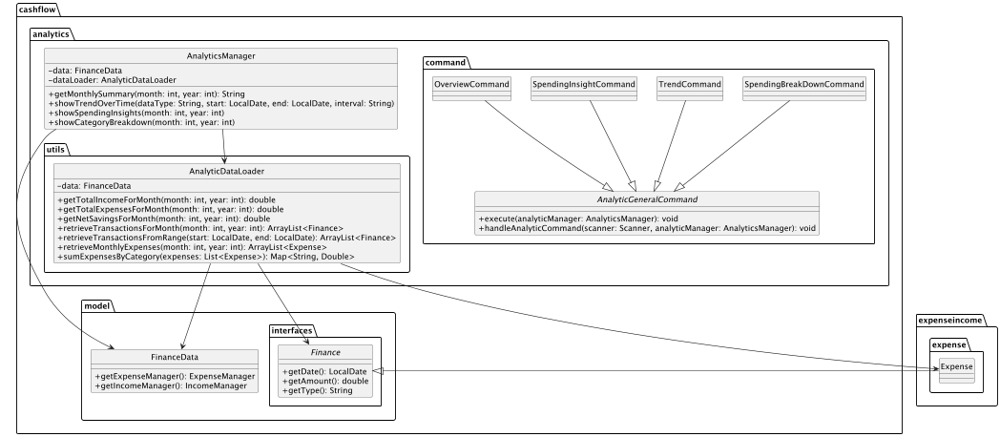
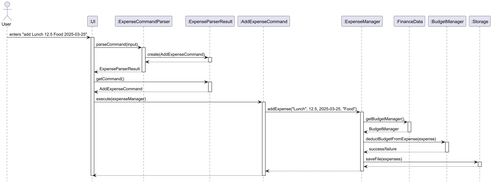
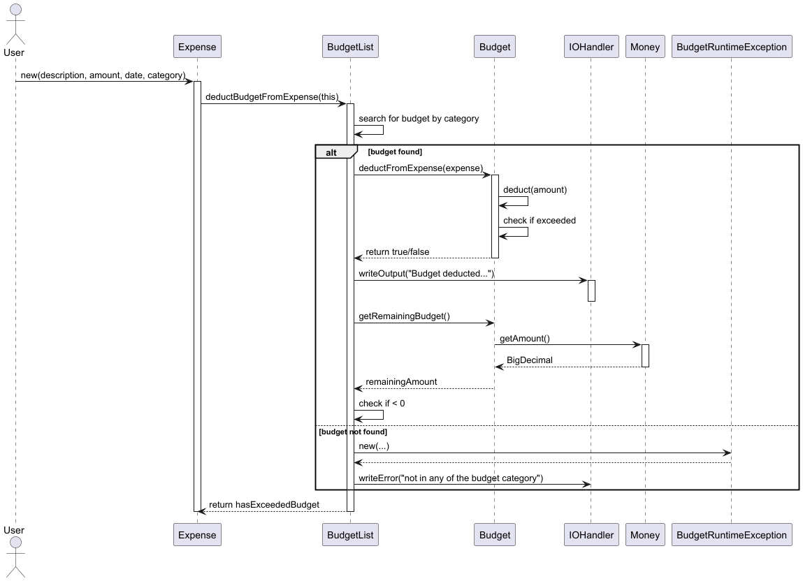
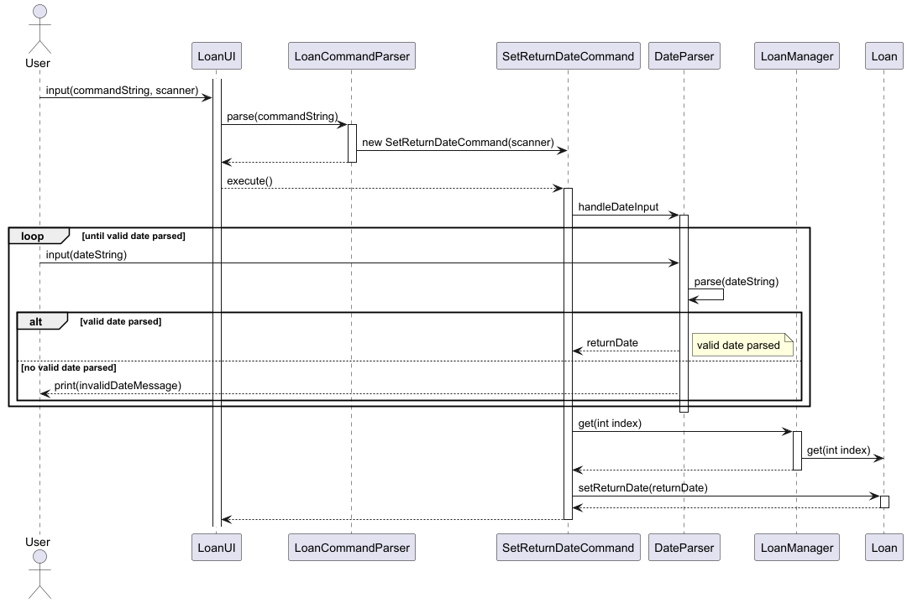
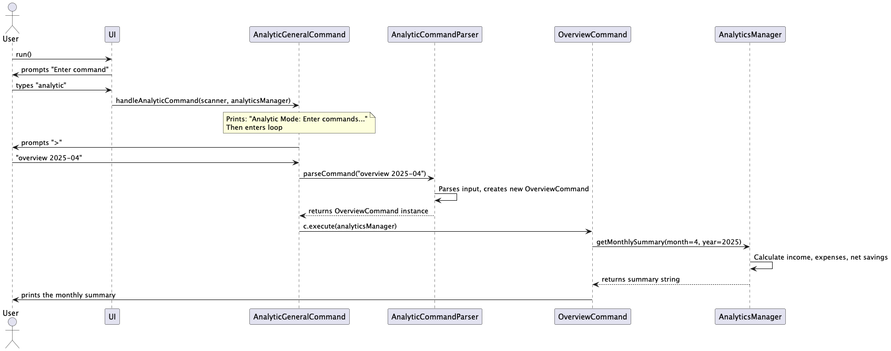

# Developer Guide

## Table of Contents

- [Design](#design)
   - [Expense Management](#expense-management)
   - [Income Management](#income-management)
   - [Budget Management](#budget-management)
   - [Saving Management](#saving-management)
   - [Loan Management](#loan-management)
   - [Application Management](#application-management)
- [Implementation](#implementation)
   - [Expense](#expense-)
   - [Income](#income)
   - [Budget](#budget-)
   - [Saving](#saving)
   - [Loan](#loan)
  -  [Analytic](#analytic-command)
- [Appendix A: Product Scope](#appendix-a-product-scope)
- [Appendix B: User Stories](#appendix-b-user-stories)
- [Appendix C: Non-Functional Requirements](#appendix-c-non-functional-requirements)
- [Appendix D: Glossary](#appendix-d-glossary)
- [Appendix E: Instructions for Manual Testing](#appendix-e-instructions-for-manual-testing)
- [Acknowledgements](#acknowledgements)

---

## Design

### Expense Management

The **Expense** modules is designed to provide full support for managing user expenses within the CashFlow application. It includes classes for command parsing, command execution, business logic, and error handling.

This module follows the **Command Pattern** for extensibility, the **Separation of Concerns** principle for maintainability, and includes robust user feedback mechanisms.

### Key Classes and Relationships

The diagram shows the how different classes within the expense package interacts with one another:



---

### Income Management

The **Income** module is responsible for managing user incomes within the CashFlow application. It mirrors the structure and principles of the Expense module, supporting features like adding, editing, deleting, listing, sorting, and category analysis for income entries.

This module follows the Command Pattern to organize operations, promotes Separation of Concerns, and ensures user-friendly parsing and error reporting.

---

### Key Classes and Relationships

The diagram below shows how different classes in the income package interact:


---

### Design Principles for both Expense and Income

- **Modularity**: Each command is encapsulated in its own class.
- **Single Responsibility**: Parsing, validation, and execution are delegated to separate classes.
- **Feedback-Oriented**: Parsers return structured results to inform users of errors without crashing the program.
- **Logging**: Uses `java.util.logging` to trace important events, hidden from the user interface.

---

### Budget Management

#### Architecture 
The Budget Management system is designed to handle all budget commands, and it also integrated with the
expense management system, to automatically track expenses and manage budget.

Below is the overview of the Budget system. It illustrates the architecture and the procedure of 
a budget command being executed.

BudgetList implements BudgetManager, and holds an Arraylist of Budgets.
The user input a string, and it parsed by BudgetAttribute, BudgetParser classes to return a command.
The command is then executed by calling methods from BudgetList.
Budget, Budgetlist throws BudgetExceptions which are catch inside Budget Commands classes.


#### Flow of the commands
To execute a command, the user first type in the CLI. The input is captured by the IOHandler class,
which then passes in the input to the BudgetGeneralCommand, which will handle all the different commands
in budget. The class then decides which command to execute based on the first keyword by the user.

The a new, specific command is created, by passing the input into the BudgetParser class, which then pass
the input to BudgetAttribute class. The reason for this is that: we can use a single class to handle all
input attributes, such as `n/`, `a/`, and return it to the parser for further processing.

The BudgetParser takes in the attributes, then select the required attribute. In this process, exceptions
are thrown as BudgetParserException, which happens in the class BudgetParser, or BudgetAttributeException,
which are exceptions found by the BudgetAttribute class.

The command then proceed to execute, which calls the method in BudgetList, and subsequently Budget for the commands.

The following sequence diagram illustrates a general flow of the Budget Management system's command.


#### Exception Handling

To properly handle exceptions and output the details of the error, so that users can quickly identify the error in input,
the exceptions are separated into many different child classes of the Exception class. A multi-level inheritance is used
where BudgetException inherits from Exceptions, while each details exceptions inherit from BudgetException.

Each detailed exception will have its own unique outputs. Which help us to identify, at which stage in the sequence diagram
did an exception happened.



---

### Saving Management
Responsible for implementing the Budget and Saving management modules. 
This includes the Saving, SavingList, and the associated commands and parsers.

The goal of these modules is to allow users to manage budgets and track savings efficiently, 
with support for adding, editing, deleting, listing, and viewing summary data.

#### Saving Architecture and Sequential Flow
The Saving Management system flow and design architecture is very similar to the Budget Management System, except that the
methods called in the Saving and SavingList are different. 
Therefore please refer to the diagrams in Budget above. Details will be explained inside the implementation.


---

### Loan Management
This includes the `Loan`, `Interest`, `LoanManager` and associated commands and parsers.

The goal of these modules is to allow users accurately and efficiently manage their loans, as well as loans between other people. The module supports the adding, editing, deleting, listing, tagging, sorting and searching entries.

#### Loan Structure

Every type of loan inherits from the abstract `Loan` class, which contains universal attributes and methods for all loans. The loans are managed by the manager class `LoanManager`, which stores loans in an `ArrayList`.

#### Interest Structure

Advanced Bullet Loans that apply interests would each refer to an `Interest` class, which specifies how the interest is applied.

The diagram below shows the high-level structure of core classes:


#### Command Parsing and Execution

To carry out operations on the loans, the user inputs are read through the `LoanUI` class and parsed by the `LoanCommandParser` class, which generates commands based on the user's inputs with the help of other parsers such as `InterestParser`, `MoneyParser` and `DateParser`.

Each command extends from an abstract `LoanCommand` base class and overrides the `execute()` method.

Due to the large number of attributes in each `Loan` class, the parser would ask for inputs sequentially.

The diagram below shows the high-level structure of loan commands:



--- 

### Other utilities

#### Money
A `Money` class is created to standardise the management of each unit of money. The Currency class for 


#### Tags
A `TagList` class and a `Taggable` interface is created to improve the efficiency of searching objects with tags. Instead of going through all objects in a collection and check if the object contains the tag, one can directly use the `findWithTag()` method to get the list of objects that contains this tag.


#### Contacts
To better manage the information of each person, a `Person` class with its manager class `ContactsList` is created to store information of each person efficiently. 


---
### Application Management
CashFlowManager is the central coordinator for initializing and running the core features of the CashFlow application. It sets up data persistence, managers for different financial modules (e.g., expense, income, savings), and launches the CLI-based UI loop.

#### Class Responsibilities
1. Load persistent storage and configuration files.

2. Initialize the following managers:

- ExpenseManager, IncomeManager, SavingList, BudgetList, LoanManager

- AnalyticsManager to manage Analytic Program
- SetUpManager to manage settings configuration
3. Set up FinanceData with initialized managers for dependency injection.

4. Handle first-time user setup with SetUpCommand.

5. Start and control the main UI loop (UI.run()).

#### Class Diagram

Here is a class diagram of CashFlowManager (references among CashFlowManager and other managers such as ExpenseManager are redacted for ease of view)


### Analytics Management
The AnalyticsManager is the core component responsible for computing financial insights for the user in CashFlow. It analyzes income and expense data from the system and provides summaries, trend analysis, and breakdowns in a human-readable format.

AnalyticsManager is the 

#### Class Responsibilities
AnalyticManager - main entry point for all analytic operations:

1. Generate monthly summaries (getMonthlySummary)

2. Print trends over time (showTrendOverTime)

3. Provide spending insights (showSpendingInsights)

4. Display expense breakdowns by category (showCategoryBreakdown)

AnalyticDataLoader - A utility class used internally by AnalyticsManager to:

1. Retrieve all transactions for a specific month or date range

2. Compute total income, expenses, and net savings

3. Filter and aggregate expense data
#### Class Diagram

Here is a class diagram of AnalyticsManager



--- 
## Implementation

### Expense 

Represents a single expense entry with attributes:
- `desc`: What the expense is.
- `amount`: A `Money` object representing the amount.
- `date`: When the expense was added.
- `category`: A tag to group the expense.

### ExpenseCommandParser

- Responsible for parsing and validating commands entered in **expense mode**.
- Produces `ExpenseParserResult` containing either a valid command or a user-friendly error message.
- Supports commands:
   - `add <description> <amount> <category> [yyyy-mm-dd]`
   - `edit <index> <newDesc> <newAmount> <newCategory> [yyyy-mm-dd]`
   - `delete <index>`
   - `list` / `list category <category>`
   - `sort recent` / `sort oldest`
   - `top` / `bottom`
   - `help`

### ExpenseParserResult

- Contains two fields:
   - `command`: an `ExpenseCommand` object (if parsed successfully).
   - `feedback`: a `String` containing an error message (if any issue occurs).

### ExpenseManager

- Stores the list of expenses and manages business logic.
- Methods include:
   - `addExpense(...)`: Validates and adds new expense.
   - `editExpense(...)`: Updates an existing expense by index.
   - `deleteExpense(...)`: Removes expense by index.
   - `listExpenses()` and `listExpensesByCategory(...)`: Lists all or filtered expenses.
   - `sortExpensesByDate(...)`: Sorts by date.
   - `printTopCategory()` / `printBottomCategory()`: Computes category statistics.

### ExpenseCommand and Subclasses

Each command like `AddExpenseCommand`, `EditExpenseCommand`, `DeleteExpenseCommand` extends `ExpenseCommand` and overrides `execute(ExpenseManager manager)`.

For example, `AddExpenseCommand`:
```java
public void execute(ExpenseManager manager) {
    manager.addExpense(description, amount, date, category);
}
```

This makes testing and future enhancements (e.g. undo/redo) straightforward.

An example of the sequence diagram for Add Expense Command is as shown:

**Note**: UI object will print a success message back to User when sequence has completed.

---

### Income

Represents a single income entry with attributes:
- `source`: Where the income came from.
- `amount`: A `Money` object representing the amount.
- `date`: When the income was received.
- `category`: A tag to group the income.

### IncomeCommandParser

- Responsible for parsing commands entered in **income mode**.
- Returns an `IncomeParserResult` object containing a valid command or an error message.
- Supports commands:
   - `add <source> <amount> <category> [yyyy-mm-dd]`
   - `edit <index> <newSource> <newAmount> <newCategory> [yyyy-mm-dd]`
   - `delete <index>`
   - `list` / `list category <category>`
   - `sort recent` / `sort oldest`
   - `top` / `bottom`
   - `help`

### IncomeParserResult

- Acts as a structured container for parsing outcomes:
   - `command`: The valid `IncomeCommand` if parsing succeeds.
   - `feedback`: Error message string to show user if parsing fails.

### IncomeManager

- Maintains an `ArrayList<Income>` and implements business logic:
   - `addIncome(...)`: Adds new income after validation.
   - `editIncome(...)`: Updates an income entry by index.
   - `deleteIncome(...)`: Removes income at specified index.
   - `listIncomes()` / `listIncomesByCategory(...)`: Lists all or filtered incomes.
   - `sortIncomesByDate(...)`: Sorts by recent or oldest.
   - `printTopCategory()` / `printBottomCategory()`: Computes income statistics.

### IncomeCommand and Subclasses

Each specific income action is encapsulated in its own class, extending `IncomeCommand`. For example, `AddIncomeCommand`, `EditIncomeCommand`, `DeleteIncomeCommand` implement their own `execute(IncomeManager manager)` method.

Example from `EditIncomeCommand`:
```java
public void execute(IncomeManager manager) {
   manager.editIncome(index, newSource, newAmount, newDate, newCategory);
}
```

This makes the logic modular, testable, and easily extendable.

An example of the sequence diagram for Edit Income Command is as shown:


**Note**: UI object will print a success message back to User when sequence has completed.
---
### Error Handling for Expense and Income

- Custom exceptions via `ExpenseException` and `IncomeException` to handle user input validation.
- Example validations:
   - Description must not be empty.
   - Amount must be positive.
   - Index must be within list bounds.
- Parser handles syntax and structure validation; Manager handles business rule validation.

### Logging for Expense and Income

- Internally uses Java’s `Logger` to log all state-changing operations.
- Warnings are logged but not shown to users unless necessary.

---

### Budget 
#### Overview of the Budget Class
The Budget contains:
```
- name: String
- totalAmount: Money
- RemainingAmount: Money
- expenses: ArrayList<Expense>
- deadline: LocalDate
- category: String
- and BudgetCompletionStatus, BudgetExceedStatus
```
The exact manipulation of the Budget Management system would be too long to describe here. In this section I will only 
show the details of a few interesting class that I have implemented, and also some proposed features that is not 
implemented yet, but will do it in the future.

#### Budget Attributes
The class currently supports the following input identifiers:

| Identifier | Field        | Type         | Description                             |
|------------|--------------|--------------|-----------------------------------------|
| `i/`       | `index`      | `int`        | 0-based index for identifying a budget  |
| `n/`       | `name`       | `String`     | Budget name                             |
| `a/`       | `amount`     | `double`     | Budget amount                           |
| `e/`       | `endDate`    | `LocalDate`  | End date of the budget (format: YYYY-MM-DD) |
| `c/`       | `category`   | `String`     | Category associated with the budget     |

1. **Input String Received**  
   The constructor of `BudgetAttributes` takes in a raw input string (e.g., `"n/Groceries a/500.0 e/2025-12-31 c/Food"`).

2. **Identifier Order & Duplication Check**
  - It ensures no identifier is repeated.
  - It checks that identifiers appear in strictly increasing order.

3. **Field Extraction & Validation**  
   The identifiers must follow these rules:
   - Amount must be greater than or equal to 0.01, and it should be a real number
   - Any decimals after 0.01 in amount is ignored. For example, `0.00103` will be parsed as just `0.01`
   - Date must strictly follow the format YYYY-MM-DD
   - Date input must be after the current date
   - Index must be a positive integer, ranging from 1 to the size of the list, depending on the list type
   - Strings must not be empty, if the identifier is declared
   
   **Note** that during BudgetAttribute parsing, 1-index base is converted to 0-index base

4. **Parsed Object**  
   The class returns itself after parsing, containing all valid fields ready for use.


The design choice to have `BudgetAttributes` return itself after construction makes it easily reusable:

- **Command classes** do not need to deal with parsing logic.
- Centralized validation ensures consistency across different parts of the application.
- Easier unit testing of parsing logic.
- The same class supports all command variants (e.g., those requiring only `i/` or only `c/`).

#### Example Usage

```java
String input = "n/Trip a/1000 e/2025-12-31 c/Travel";
BudgetAttributes attributes = new BudgetAttributes(input);

String name = attributes.getName();          // "Trip"
double amount = attributes.getAmount();      // 1000.0
LocalDate end = attributes.getEndDate();     // 2025-12-31
String category = attributes.getCategory();  // "Travel"
```
#### Integrating Budget with Expense
A key feature to our application is that it can automatically deduct an expense from a budget. 
This integration between two major classes is to allow users to know the status of their budgets 
after adding their expenses. This is provided that
both the expense and the budget are in the same category, and the expense is within the time frame of the budget.

After the expense is added, the constructor will call the BudgetManager to execute the method `deductBudgetFromExpense()`
as illustrated by the sequence diagram below:

It is done by calling a boolean method from `Expense Manager` to check if budget is exceeded or not. 
A warning will be displayed if budget has been exceeded.

**Important note**: to smoothly integrate with expense, budget category will be changed to non-case sensitive.
The string is converted such that the first letter is capitalized, while the rest are converted to lower case.

```
BudgetManager budgetManager = data.getBudgetManager();
if (budgetManager != null) {
   boolean exceeded = budgetManager.deductBudgetFromExpense(expense);
   if (exceeded) {
       System.out.println("Warning: You have exceeded your budget for category: " + category);
   }
}
```




#### [Future Features] Deleting a Budget 
Deleting a budget is an upcoming feature that is still under development, but it is important to let user
to have the freedom of deleting redundant or no longer used budgets.

---

### Saving

This is an example of the implementation of the Budget and Saving command: `Set Budget`,
which can represent the generic flow of the Budget and Saving management's execution flow.

1. The user inputs the set-budget command.

2. LogicManager (`BudgetGeneralCommand`) passes it to SetBudgetCommandParser.

3. A Budget object is created.

4. SetBudgetCommand is constructed with the budget.

5. Execute(`BudgetList`) adds the budget to the model.

6. The UI reflects the update by printing a success message and the attributes of the `Budget`.


#### General Logic For Budget and Saving in sequence diagram:


---

### Loan

#### Abstract class Loan

The abstract class Loan contains the following attributes:

- `lender`: The `Person` that lends the money. Cannot be modified.
- `borrower`: The `Person` that borrows money from the `lender`. Cannot be modified.
- `principal`: The original `Money` lent.
- `isReturned`: Whether the loan has been returned.
- `startDate`: The date the loan is lent.
- `returnDate`: The date the loan is to be returned.
- `tags`: An `ArrayList<String>` of tags to categorise the loans.

#### Simple Bullet Loan subclass
The `SimpleBulletLoan` is a type of loan with fixed balance and one-shot repayment.

#### Advanced Bullet Loan subclass
The `AdvancedBulletLoan` is a type of loan with interests and one-shot repayment. Apart from the basics of the `Loan` class, it also contains the following attributes:

- `outstandingBalance`: The `Money` to be returned after applying interest.
- `interest`: The `Interest` to be applied.

#### Interest
The `Interest` class specifies how the interest applies to a loan. It contains the following attributes:

- `type`: The type of interest as defined in the `InterestTye`.
- `rate`: The percentage increment of the `outstandingBalance` at the end of each `period`.
- `period`: The `Period` between each time the interest is applied.

#### InterestParser
- Parses an `Interest` based on the `String` input. The format is shown below:
```
[SIMPLE / COMPOUND] [rate] per [X years/months/days]
```
- Also contains a `handleInterestInputUI()` method that handles invalid interest inputs and ask for new inputs, until a valid `Interest` is parsed.

#### LoanManager
Stores all recorded `Loan`s in an `ArrayList<Loan>` and supports the following operations:

Storing Loans:
- **`storeLoans()`**  
Updates the storage by writing the current list of loans.

Adding and Removing Loans:
- **`add(Loan loan)`**  
Adds a new loan to the list, updates the `tagList`, and ensures both the lender and borrower are in the `contactsList`.
- **`delete(int x)`**  
Removes the Xth loan in the list, clears its tag mappings, updates the save file.

Adding and Removing Tags:
- **`addTag(int x, String tag)`**  
  Adds a tag to the Xth loan and updates the `tagList`.
- **`deleteTag(int x, String tag)`**  
  Removes a tag from the Xth loan and updates the `tagList`.

Finding Loans:
- **`get(int x)`**  
  Returns the Xth loan in the list.
- **`findIncomingLoan(Person borrower)`**  
  Returns a list of loans borrowed by the `borrower`.
- **`findOutgoingLoan(Person lender)`**  
  Returns a list of loans lent by the `lender`.
- **`findAssociatedLoan(Person person)`**  
  Returns all loans lent or borrowed by the person.
- **`findOverdueLoan()`**  
  Returns a list of loans that are currently overdue.
- **`findUrgentLoan(int x)`**  
  Returns the top x loans with the earliest return dates.
- **`findLargestLoans(int x)`**  
  Returns the top x loans with the highest balance.
- **`findLoan(Person lender, Person borrower)`**  
  Returns loans from `lender` to `borrower`.
- **`findLoanWithTag(String tag)`**  
  Returns loans that contain the `tag`.

Analytics:
- **`getTotalDebt(String name)`**  
  Returns a `HashMap<Currency, BigDecimal>`, mapping the person's total debt in each currency.
- **`getTotalLent(String name)`**  
  Returns a `HashMap<Currency, BigDecimal>`, mapping the person's total amount lent in each currency.

User Interface Outputs:
- **`simpleFulList()`**  
  Returns a ready-to-print `String` listing all loans with basic information.
- **`showDetail(int x)`**  
  Returns a ready-to-print `String` containing all information of the Xth loan in the list.

#### LoanUI
Runs continuously when the program is in `loan` mode. Reads the user input, generates commands using `LoanCommandParser` and executes the commands.

#### LoanCommandParser
Contains methods to parse commands from various user inputs. Due to the large amount of attributes in each `Loan`, the parsers would ask for user inputs sequentially. The commands would then call the respective methods in `LoanManager` to get or modify information.

An example simplified sequence diagram of the `EditReturnDateCommand` is shown below:



An example input/output conversation of the `AddAdvancedBulletLoanCommand` is shown below:
```
Loan Mode: Enter commands (type 'exit' to return)
> add
With or without interest? (y/n)
> n
Enter the lender's name:
> Qiaozi
New person: [Qiaozi]
Enter the person's contact number (Enter N/A if not applicable):
> 12345678
Enter the person's E-Mail (Enter N/A if not applicable):
> someone@example.com
New person [Qiaozi] is added to the contact book.
Enter the borrower's name:
> George
New person: [George]
Enter the person's contact number (Enter N/A if not applicable):
> N/A
Enter the person's E-Mail (Enter N/A if not applicable):
> N/A
New person [George] is added to the contact book.
Key in the amount of money lent:
> 500
Key in the description (Key in "N/A" if not applicable):
> Example
Key in the start date of the loan (yyyy-mm-dd) (Key in "N/A" if not applicable):
> 2023-08-08
Key in the return date of the loan (yyyy-mm-dd) (Key in "N/A" if not applicable):
> 2022-01-01
The return date cannot be before the start date
Key in the return date of the loan (yyyy-mm-dd) (Key in "N/A" if not applicable):
> 2025-01-01
Key in a tag (Key in "N/A" to finish):
> N/A
Tasks saved successfully!
Simple Bullet Loan added: Lender: [Qiaozi]    Borrower: [George]
    Amount: USD 500.00    Not Returned
```

### Other Utilities

#### Person
Contains the following attributes:

- `name`: The name of the person. Cannot be edited.
- `contactNumber`: The contact number of the person. Must contain at least a series of numbers.
- `email`: The E-Mail of the person. Must contain a "@" character.
- `tags`: An `ArrayList<String>` of tags to categorise the people.

#### ContactsList
Instantiated within the `LoanManager` class to support the efficient usage of each known person's information. It stores the information using a `HashMap<String, Person>`, mapping each person's unique name and its instance. Operations are shown below:

- `add(String name)`: Creates a new person with a name.
- `add(Person person)`: Adds an existing person.
- `delete(String name)`: Deletes the named person.
- `addTag(Person person, String tag)`: Add a given tag to the person. Updates the `tagList`.
- `removeTag(Person person, String tag`: Deletes the tag from the person. Updates the `tagList`.
- `hasPerson(String name)`: Checks if a person with the name is recorded.
- `findName(String name)`: Finds the person mapped to the name.
- `findTag(String tag)`: Returns an `ArrayList<Person>` of all people with the tag.
- `listAll()`: Lists all recorded person's name.

#### DateParser
Parses a `LocalDate` given the input `String`. Also contains methods to continuously ask for user input until a valid date is parsed.

#### MoneyParser
Parses a `Money` given the input `String`. Also contains methods to continuously ask for user input until a valid money is parsed.

#### Taggable interface
This interface is available for any object that can be tagged. Each `Taggable` object contains an `ArrayList<String>` of tags. The interface contains the following methods:

- `addTag(String tag)`: Adds a tag to the list of tags.
- `removeTag(String tag)`: Removes a tag from the list of tags.
- `getTagList()`: Returns an `ArrayList<String>` of all tags this object has.

#### TagList
This class can be instantiated in the managers of `Taggable` objects. It stores all objects of type (T implements Taggable) in a `HashMap<String, ArrayList<T>>`. It allows the managers to categorise and search for objects based on their tags easily and efficiently. Supported methods are shown below:

- `addMap(String tag, T object)`: Adds a mapping of the tag and the object to the HashMap.
- `removeMap(String tag, T object)`: Removes the mapping of the tag and the object.
- `removeObject(T object)`: Removes the object from all tag mappings.
- `findWithTag(String tag)`: Returns an `ArrayList<T>` of objects containing the tag.

#### Custom Exceptions

- `DateUndefinedException`: thrown when the start date of an `AdvancedBulletLoan` is invalid.
- `EmptyNameException`: thrown the input for a `Person`'s name is blank.
- `PersonNotFoundException`: thrown when the `ContactList` does not contain the input name.
- `SameNameException`: thrown when adding a `Person` to the `ContactList` that already contains a `Person` with the same name.
- `StartDateException`: thrown when setting the start date of a loan to be after the previously defined return date.
- `ReturnDateException`: thrown when setting the return date of a loan to be before the previously defined start date.
- `NegativeValueException`: thrown when the user inputs a negative `Money` amount, `Interest` rate or other value that is not supposed to be negative.
- `CurrencyNotMatchException`: thrown when trying to compare two `Money` of different currencies.

---

### Analytic Command
Here are the implementation of OverviewCommand, one of the four analytic commands, along with a sequence diagram: 
1. **UI.run()**

- The UI class begins listening for user commands in its run() method.

- The user types "analytic", and the UI invokes AnalyticGeneralCommand.handleAnalyticCommand(scanner, analyticsManager).

- This kicks off the “Analytic Mode,” where the system prompts for analytic commands (overview, trend, etc.).

2. **handleAnalyticCommand**

- Inside AnalyticGeneralCommand.handleAnalyticCommand(), the method prints a welcome message ("Analytic Mode: Enter commands...") and loops, continually reading lines from the user.

- When the user types "overview 2025-04", it captures that input for parsing.

3. **Parsing the Command**

- Next, AnalyticGeneralCommand calls AnalyticCommandParser.parseCommand("overview 2025-04").

- AnalyticCommandParser instantiates a new OverviewCommand(4, 2025)

4. **Execution of OverviewCommand**

- After returning the newly created OverviewCommand, handleAnalyticCommand calls overviewCommand.execute(analyticsManager).

- In execute(), the command calls method getMonthlySummary(month, year) from AnalyticManager.

5. **Analytics Logic**

- AnalyticsManager fetches relevant data—like total income, total expenses, and net savings—for April 2025 via its helper (AnalyticDataLoader).

- It assembles a final summary string, including comparisons to March 2025, and returns it to OverviewCommand.

6. **User Output**

- Finally, OverviewCommand prints the returned summary string to the console, displaying the monthly overview to the user.




---
## Appendix A: Product Scope

### Target user profile

- CLI users who prefer keyboard-based interactions.
- Budget-conscious individuals tracking daily spending.
- Students, young adults or working professionals managing personal finances.
- People who don't remember their loans and debts well.

### Value proposition

- Easy and fast, keyboard-based way of recording transactions.
- No setup or signup — works locally and offline.
- Lightweight and highly customizable.
- Comprehensive personal finance toolings including Expense & Income Manger, Saving & Budget Manager, Loan Manager and Analytics Manager.

## Appendix B: User Stories

| Priority | As a ... | I want to ...                  | So that I can ...                                               |
|----------|-----------|--------------------------------|-----------------------------------------------------------------|
| High     | User | Add expenses                   | Track spending                                                  |
| High     | User | Edit/delete expenses           | Fix mistakes                                                    |
| Medium   | User | Sort expenses                  | View spending trends                                            |
| Medium   | User | See top category               | Analyze major expenses                                          |
| High     | User | Add income sources             | Record earnings                                                 |
| High     | User | Set budgets                    | Stay within limits                                              |
| Medium   | User | Check on budgets               | Get insights of spending history and remaining budgets          |
| Medium   | User | List all budgets               | Get a short summary of my budgets                               |
| High     | User | Modify budgets                 | Change any attributes if I want                                 |
| High     | User | Deduct expenses from budgets   | easily track my budget without manually adding expenses into it |
| High     | User | Set goals                      | Reach financial milestones                                      |
| High     | User | Add contributions to goals     | Have a better idea of how much I have saved                     |
| Medium   | User | Delete goals                   | Have the freedom to discard any goals                           |
| Medium   | User | Delete contributions           | Have the freedom to discard or unsave a contribution            |
| Medium   | User | Check on savings               | Get insights of saving history                                  |
| Medium   | User | List all savings               | Get a short summary of my savings                               |
| Low      | User | Track loanManager              | Manage borrowings and lending                                   |
| High     | User | See monthly financial summary  | Manage my finances better                                       |
| Medium   | User | See financial trends over time | Understand my financial habits and plan wisely                  |
| Medium   | User | See spending insights          | Make wiser spending decisions                                   |
| Medium   | User | Add loans                      | Track my debts                                                  |
| Medium   | User | Edit loans                     | Fix my input mistakes                                           |
| Medium   | User | Delete loans                   | Remove unnecessary loan records                                 |
| Medium   | User | List loans                     | Have a cleared idea of how much I owe                           |
| Medium   | User | Sort loans                     | Be reminded of the most important loans                         |
| Medium   | User | Store people I know            | Get their contact information quickly                           |
| Medium   | User | Set loan status                | Know how much I have worked to return my debts                  |
| Medium   | User | Find loans based on attributes | Get information of wanted loans quickly                         |

---

## Appendix C: Non-Functional Requirements

- Should work on Windows, MacOS, and Linux with Java 17+.
- Must handle 100+ records without performance drop.
- CLI should respond within 1 second per command.

---

## Appendix D: Glossary

- **CLI**: Command Line Interface. A text-based interface where users interact with the program by typing commands.
- **Index**: The number shown when listing items; used to refer to entries in a list (1-based for user, 0-based in code).
- **IOHandler**: A utility class that handles all input/output operations. Abstracts away calls to `System.out` and `System.err` for better modularity and testability.
- **Expense**: Money spent by the user on items such as food, transport, or utilities.
- **Income**: Money received by the user from various sources like salary, gifts, or investments.
- **Budget**: A financial constraint defined by the user for a particular category, with a total amount and deadline.
- **Loan**: Money lent or borrowed, optionally with interest applied over time.
- **Simple Bullet Loan**: A loan with no interest, and one-shot repayment.
- **Advanced Bullet Loan**: A loan that applies interest, with one-shot repayment.
- **Principal**: The original amount money lent.
- **Saving**: A goal the user is saving money towards, tracked by name, amount, and deadline.
- **Category**: A label to classify a transaction (e.g., "Food", "Travel", "Salary", "Entertainment").
- **Command Pattern**: A software design pattern where each operation is encapsulated in a separate object that implements a common interface (e.g., `execute()` method).
- **Parser**: A class responsible for converting raw user input into structured data or command objects. Different parsers exist for each module (e.g., `BudgetParser`, `ExpenseCommandParser`).
- **Attribute class**: A utility class (e.g., `BudgetAttributes`) that extracts fields from user input using identifiers like `n/` (name), `a/` (amount), `e/` (end date).
- **Identifier**: A prefix used in command input strings to label arguments. For example:
    - `n/` = name
    - `a/` = amount
    - `e/` = end date
    - `c/` = category
    - `i/` = index
- **Money**: A class representing an amount of currency with support for precision and arithmetic operations.
- **Finance**: An abstract class extended by financial entities like `Budget`, `Income`, `Expense`, and `Loan`.
- **Interest**: A class used by `AdvancedBulletLoan` to apply and calculate interest over time.
- **Command**: A base class/interface for all user actions (e.g., `AddExpenseCommand`, `DeleteBudgetCommand`). Each command overrides `execute(...)`.
- **Mode**: A context in which the user interacts with a specific feature (e.g., "expense mode", "budget mode"). Each mode has its own set of valid commands.
- **Tag**: A `String` variable assigned to an object in order to categorise it.


---

## Appendix E: Instructions for Manual Testing

### Expense Module

1. Run `expense` to enter expense mode.
2. Try:
   ```
   add Lunch 10 Food 2025-04-01
   list
   edit 1 Dinner 20 Food
   delete 1
   sort recent
   ```

### Income Module

1. Run `income` mode.
2. Try:
   ```
   add Salary 3000 Job 2025-04-01
   edit 1 Bonus 500 Job
   list
   delete 1
   ```

### Budget Module
1. Run `budget` to enter budget mode from the main menu.
2. Try:
```
set n/Trip a/1000 e/2025-12-31 c/Travel
check i/1
list
deduct i/1 a/200
modify i/1 [n/Holiday] [a/300] [e/2025-10-10] [c/Trip]
```
**Note**: the attributes in `[ ]` are optional to include. If not included, the program assumes
the attribute is not modified. For example, `modify i/1 a/500 c/Trip` only modifies `amount` and `category`,
but does not modify `name` and `endDate`.

### Saving Module
1. Run `saving` to enter budget mode from the main menu.
2. Try:
```
set n/Laptop a/2000 b/2025-10-01
contribute i/1 a/500
list
delete-s i/1
delete-c i/1 c/1
```

### Loan Module
1. Run `loan` to enter budget mode from the main menu.
2. Try:
```
help
help edit
help find
help add
add
list
show 1
edit 1 description
find largest loan
delete 1
```
### Analytic Module
1. Run `analytic` to enter analytic mode from the main menu.
2. Try:
```
overview 2025-03                                   
trend income 2025-04-01 2025-05-02 weekly
insight                            
spending-breakdown 2024-12                                 
```
---

## Acknowledgements

- This project reused some ideas and interfaces from the [AddressBook-Level3](https://github.com/se-edu/addressbook-level3) project.
- Structure and format of the Developer Guide closely follow AB3’s conventions.

